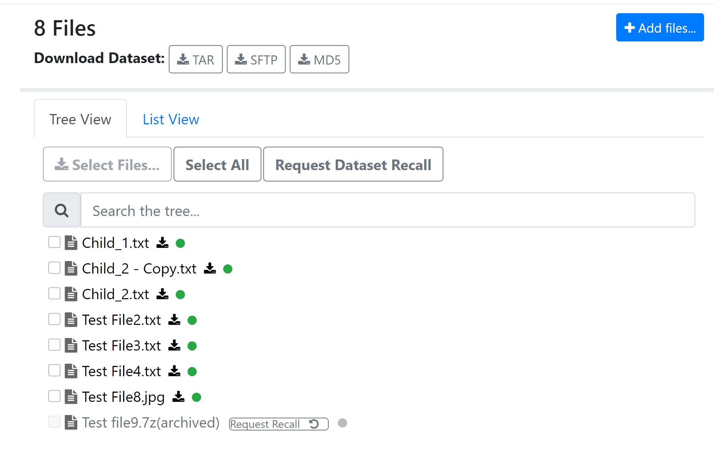
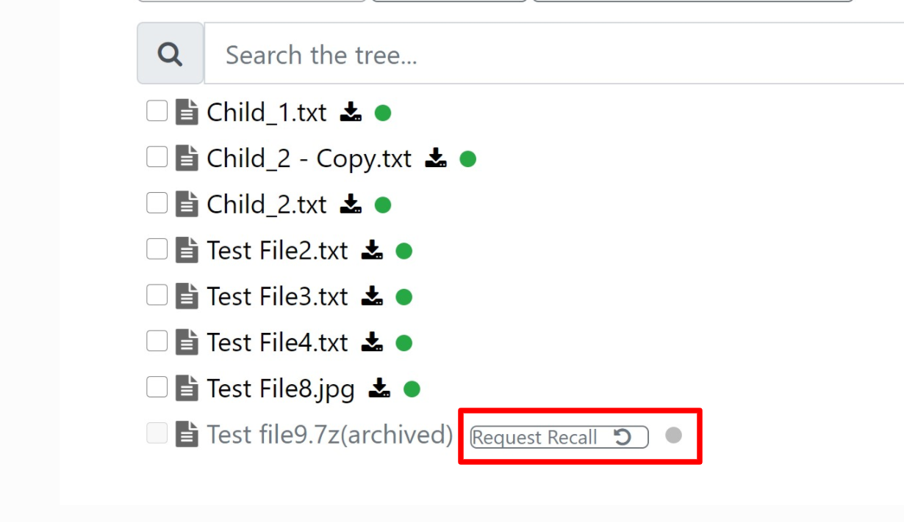
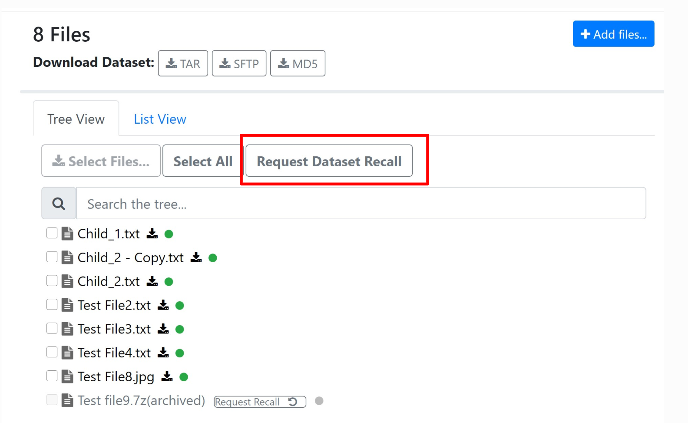

HSM App
=============

Store.Monash now supports displaying online/offline status for files in the Hierarchical Storage Management system. Users can also submit a request to recall an offline file or a dataset.

Online/Offline status
----------------------

On the dataset view page under tree view and list view, each file will have a status symbol indicating if it is online or offline.
If a file is online, there will be a green dot indicating online status.
If a file is offline, there will be a gray dot indicating offline status.

Request to recall a datafile
---------------------------

For an offline file, users can request to recall the file by clicking on the Request Recall button.
An asynchronous process will try to recall this file and if successful, will send an email to the user with a link to download the file.

Request to recall a dataset
--------------------------

Users can also submit a request to recall all files in a dataset by clicking on the Request Dataset Recall button.
This will send an email to the storage team and the user will be notified when the dataset is available for download.

